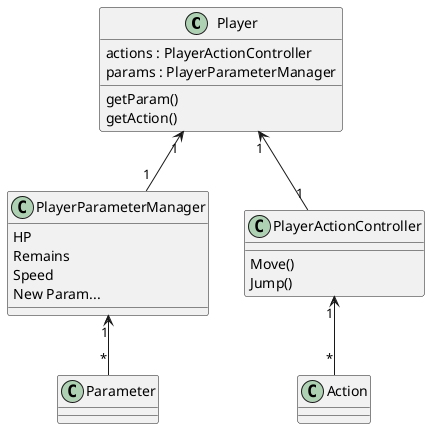

# プレイヤー仕様

Unity Editor 上では"Player"

# 機能

- 移動
- ジャンプ

```plantuml
@startuml
class Player{
    actions : PlayerActionController
    params : PlayerParameterManager
    getParam()
    getAction()
}
class PlayerParameterManager{
    HP
    Remains
    Speed
    New Param...
}
class PlayerActionController{
    Move()
    Jump()
}
' Playerとのつながり
Player "1" <-- "1" PlayerActionController
Player "1" <-- "1" PlayerParameterManager

' ActionControllerのつながり
PlayerActionController "1" <-- "*" Action
' ParameterManagerのつながり
PlayerParameterManager "1" <-- "*" Parameter
@enduml
```
