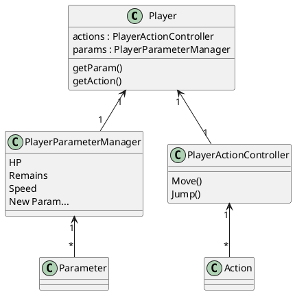
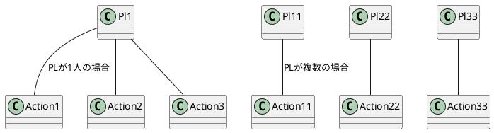

# プレイヤー仕様

Unity Editor 上では"Player"

# 機能

- 移動
- ジャンプ

# UML

### 検証 : Player が Action, Param 以外を持つ可能性

1. テクスチャ変更\
   ダメージ、モードチェンジ etc...

2. サウンド変更\
   キャラ変、ヘリウム的ギミック、無音化 etc...

もし PL が複数いるなら、PL と Action を紐づけする関係クラスを設けたほうがいいかもしれない
